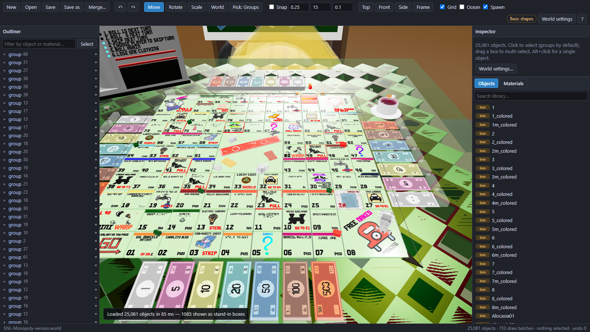

# 3DX World Editor

A fast 3D editor for 3DXChat `.world` files. It opens 25,000-object worlds in under a second and stays smooth while you select, move, rotate, scale, recolour, group and duplicate.

**[Open it in your browser](https://deaeath.github.io/3dx-world-editor/)** — it starts with the SNL Monopoly board loaded so you can try it right away.

## Two ways to run it

| | Website | Desktop app |
|---|---|---|
| Install | Nothing | Download, double-click |
| Models | Basic building shapes drawn by the editor; click **Link game** to read the real models and textures from your own 3DXChat folder, right in the browser | The real 3DXChat models and materials, read from **your own** game install |
| Open / save | Your browser's file picker (or download) | Straight to disk, with a `.bak` of the previous version on every save |

Nothing from the game is included in this repository or on the website. The desktop app reads models, materials and textures from the 3DXChat install on your PC and keeps them in a local cache (`%LOCALAPPDATA%\3DXWorldEditor`).

### Link your game (website)

Click **Link game** and pick your 3DXChat **Game** folder (the one containing `3DXChat_Data`). The browser reads the models and textures from it on your PC — nothing is uploaded, even if the browser's prompt says "upload" — and the world redraws with the real models in about ten seconds. Chrome and Edge remember the folder, so next time it's one click. Textures the game stores in Unity's "crunched" format keep their average colour on the website; the desktop app shows all of them.

### Desktop app

Download `3DXWorldEditor.exe` from the [latest release](https://github.com/Deaeath/3dx-world-editor/releases/latest) and run it. The first time, it finds your 3DXChat folder and reads the game's models (about two minutes). It then opens the editor in your browser at `http://127.0.0.1:8790`.

From source (Python 3.10+): double-click `Start-WorldEditor.bat`, or run `python server.py`.

## Controls

| | |
|---|---|
| W A S D, Q / E | Move, down / up (Shift = fast) |
| Right-drag | Look around (wheel while right-dragging sets fly speed) |
| Wheel / middle-drag / Alt + left-drag | Zoom to cursor / pan / orbit |
| Click / Alt+click / double-click | Select group / single object / step into a group |
| Drag on empty space | Box select (Shift adds) |
| 1 / 2 / 3, L, X | Move / rotate / scale gizmo, local-world gizmo, snapping |
| Ctrl+D, Ctrl+C/V, Ctrl+G | Duplicate, copy/paste (works between worlds), group |
| Delete, H, F | Delete, hide (editor only), frame selection |
| Ctrl+Z / Ctrl+Y, Ctrl+S | Undo / redo, save |
| 7, Numpad 7 / 1 / 3 | Top / front / side view |

The inspector edits object type, material, colour, position, rotation (in the game's degrees) and scale. The library adds any 3DXChat object or applies any material to the selection. **Merge** imports another world as a group, and **Export** saves the selection as its own `.world`.

## How it works

- `docs/` is the editor (plain HTML/JS with [three.js](https://threejs.org)); GitHub Pages serves it as-is.
- The world is drawn with one instanced draw call per shape + material, so object count barely matters. It only re-renders when something changes.
- Positions and rotations are converted between Unity's left-handed space and three.js exactly. Saving writes the game's own compact format, and objects you did not touch keep exactly the same values.
- `server.py` (standard library only) serves the editor locally and reads/writes `.world` files. It listens on 127.0.0.1 and every request needs a per-session token.
- `extract_assets.py` reads the world-editor prefabs, materials and textures from the game's plain data files with [UnityPy](https://github.com/K0lb3/UnityPy). Some decorative models only exist in the game's encrypted bundles; those show as correctly sized boxes.
- `make_lite_catalog.py` builds `docs/lite/catalog-lite.json` for the website: object names, sizes, material colours, and which game mesh/texture each object uses (by name and size) — no meshes or textures.
- `docs/js/unity/` reads Unity 2021.3 data files in the browser for **Link game**: the object table, a type-tree reader (Mesh and Texture2D layouts from UnityPy's database), vertex streams and compressed meshes. Textures go to the GPU still compressed.

## Part of 3DXModKit

The editor is also available as a companion app in [3DXModKit](https://github.com/Deaeath/3DXModKit).

---

Not affiliated with SexGameDevil. 3DXChat is their product. The SNL Monopoly board is a community build included as a demo.

MIT License.
